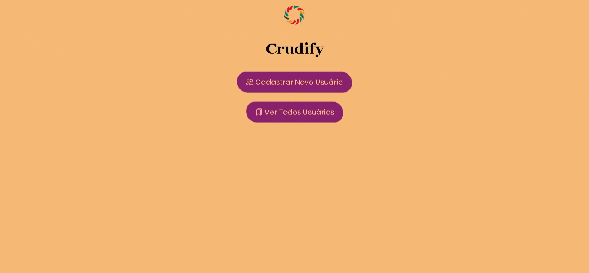
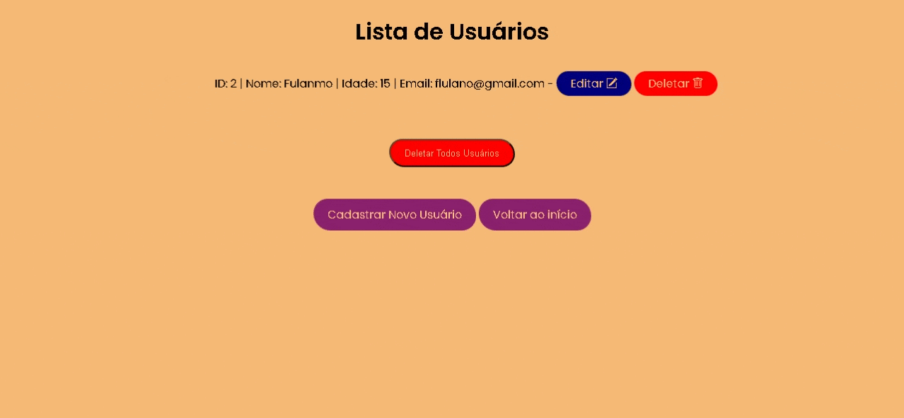

# 💱 Data Manager

Um CRUD com **Python**, usando:

- A biblioteca `Sqlite3` para acessar uma **Criação de Banco De Dados**
- A biblioteca `Flask` para criar uma **interface web**


---
            **Registro**

            **Deletar e Atualizar**


## O que esse projeto faz

- Aplicação com Flask para Desenvolvimento Web
- Uso das Ferramentas SQLITE3 para uso do CRUD
- CREATE, READ, UPDATE, DELETE


---

## Tecnologias

- Python 3
- [Flask](https://flask.palletsprojects.com/) – cria o site local
- [Sqlite3](https://www.sqlite.org/docs.html) – criação do banco de dados

---

## Como instalar e rodar

1. **Clone o repositório:**

```bash
git clone https://github.com/seu-usuario/flask-data-manager.git
cd currency_converter
```


